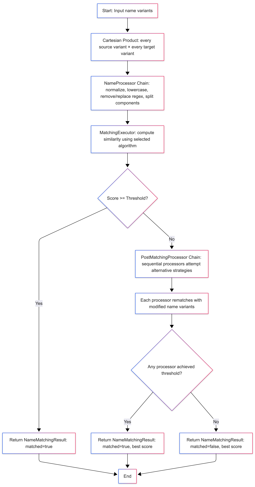
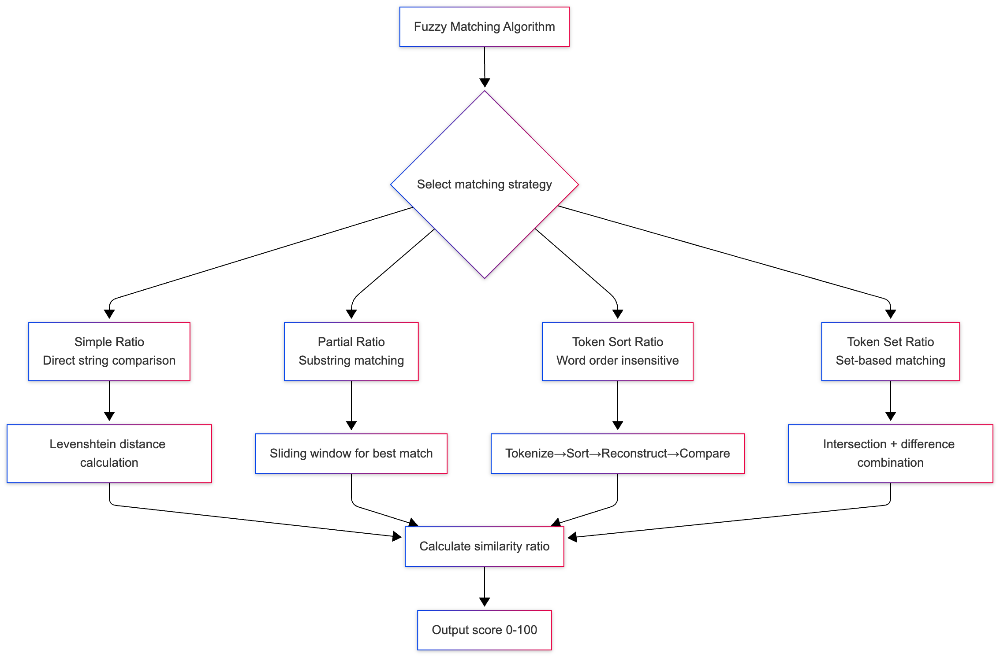
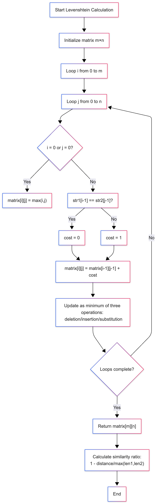

# PII Matching Tools Library — Comprehensive Usage Guide

[](https://openjdk.java.net/)  
[](https://maven.apache.org/)  
[](LICENSE.md)  
[](pom.xml)

## Contents

- Overview
- Features
- Algorithms
- Architecture
- Dependencies
- Installation
- Quick Start
- API Reference
- Usage Examples
- Supported Languages
- Configuration
- Testing
- Best Practices
- Troubleshooting
- Advanced Usage
- Contributing
- FAQ
- License
- Support

---

## Overview

MatchingUtils is a PII (Personally Identifiable Information) name-matching library designed for Global Travel Rule
compliance. It provides advanced fuzzy matching across multiple languages and scripts, including Simplified/Traditional
Chinese, Japanese, Korean, Arabic, Russian, Thai, and Latin-based languages.

Primary use cases:

- KYC (Know Your Customer) verification
- Cross-border financial transaction compliance
- Identity verification in multi-language environments
- Fuzzy name matching for KYC verification
- AML (Anti-Money Laundering) screening

---

## Features

- Multi-language support (Chinese, Japanese, Korean, Arabic, Russian, Thai, Latin scripts)
- Fuzzy matching with configurable similarity thresholds
- Traditional/Simplified Chinese conversion using OpenCC
- Batch processing and thread-safe execution
- Extensible plugin-based architecture for custom matching algorithms
- Detailed match results and trace output
- Intelligent handling of diacritics, hyphens, apostrophes, spaces, and name order variations

---

## Algorithms

### Token Sort Ratio



```text
graph TD
    A[Start: Input strings str1, str2] --> B[Preprocess: Convert to lowercase & remove punctuation]
    B --> C[Tokenize: Split into word lists by whitespace]
    C --> D[Sort: Alphabetically sort tokens]
    D --> E[Reconstruct: Join sorted tokens with spaces]
    E --> F{Check empty strings?}
    F -->|Yes| G[Return score: 0]
    F -->|No| H[Calculate Levenshtein ratio]
    H --> I[Return similarity score 0-100]
    I --> J[End]
```

### Detailed Process Description

- Input Processing Phase:

```text
Input: "Hello World", "World Hello"
↓
Preprocessing: "hello world", "world hello"  
↓
Tokenization: ["hello", "world"], ["world", "hello"]
↓
Sorting: ["hello", "world"], ["hello", "world"]
↓
Reconstruction: "hello world", "hello world"
```

- Similarity Calculation:

```text
Reconstructed strings → Levenshtein ratio calculation → Output: 100
```

### Core Fuzzy Matching Algorithm



```text
graph TD
    A[Fuzzy Matching Algorithm] --> B{Select matching strategy}
    
    B --> C[Simple Ratio<br/>Direct string comparison]
    B --> D[Partial Ratio<br/>Substring matching]
    B --> E[Token Sort Ratio<br/>Word order insensitive]
    B --> F[Token Set Ratio<br/>Set-based matching]
    
    C --> C1[Levenshtein distance calculation]
    D --> D1[Sliding window for best match]
    E --> E1[Tokenize→Sort→Reconstruct→Compare]
    F --> F1[Intersection + difference combination]
    
    C1 --> G[Calculate similarity ratio]
    D1 --> G
    E1 --> G
    F1 --> G
    
    G --> H[Output score 0-100]
```

### Levenshtein Distance Calculation



```text
graph TD
    A["Start Levenshtein Calculation"] --> B["Initialize matrix m×n"]
    B --> C["Loop i from 0 to m"]
    C --> D["Loop j from 0 to n"]
    D --> E{"i = 0 or j = 0?"}
    E -->|Yes| F["matrix[i][j] = max(i,j)"]
    E -->|No| G["str1[i-1] == str2[j-1]?"]
    G -->|Yes| H["cost = 0"]
    G -->|No| I["cost = 1"]
    H --> J["matrix[i][j] = matrix[i-1][j-1] + cost"]
    I --> J
    J --> K["Update as minimum of three operations: <br> deletion/insertion/substitution"]
    K --> L{"Loops complete?"}
    L -->|No| D
    L -->|Yes| M["Return matrix[m][n]"]
    M --> N["Calculate similarity ratio: <br> 1 - distance/max(len1,len2)"]
    N --> O["End"]
```

### Token Sort Ratio Detailed Data Flow Example

```text
Input: 
str1 = "Apple Orange Banana"
str2 = "Banana Apple Orange"

Processing Steps:
1. Preprocessing → "apple orange banana", "banana apple orange"
2. Tokenization → ["apple", "orange", "banana"], ["banana", "apple", "orange"]  
3. Sorting → ["apple", "banana", "orange"], ["apple", "banana", "orange"]
4. Reconstruction → "apple banana orange", "apple banana orange"
5. Calculation → Levenshtein("apple banana orange", "apple banana orange") = 0
6. Ratio → 1 - 0/18 = 1.0 × 100 = 100
```

### Algorithm Characteristics Summary

| Algorithm Type    | Use Case                              | Time Complexity | Space Complexity |
|-------------------|---------------------------------------|-----------------|------------------|
| Simple Ratio      | Exact matching of same-length strings | O(n²)           | O(n²)            |
| Token Sort Ratio	 | Text with different word orders       | O(n log n + n²) | O(n²)            |
| Token Set Ratio   | Text with inclusion relationships     | O(n log n + n²) | O(n²)            |
| Partial Ratio     | Substring matching                    | O(m×n)          | O(n)             |

---

## Architecture (modules)

- MatchingUtils — main entry point with static methods
- MatchingExecutor (interface) — extension point for custom algorithms
- MatchingNamesProcessor (interface) — pre-processing of names
- MatchingAlgorithm (enum)
- NameMatchingOptions / MatchingOptions — configuration classes
- MatchingResult / NameMatchingResult — result classes

Component flow (conceptual):
MatchingUtils -> MatchingExecutor (implementation) -> MatchingNamesProcessor -> MatchingAlgorithm ->
NameMatchingOptions -> NameMatchingResult

---

## Dependencies (Maven)

```xml

<dependencies>
    <dependency>
        <groupId>com.github.houbb</groupId>
        <artifactId>opencc4j</artifactId>
        <version>1.14.0</version>
    </dependency>

    <dependency>
        <groupId>me.xdrop</groupId>
        <artifactId>fuzzywuzzy</artifactId>
        <version>1.4.0</version>
    </dependency>

    <dependency>
        <groupId>org.slf4j</groupId>
        <artifactId>slf4j-api</artifactId>
        <version>2.0.16</version>
    </dependency>

    <dependency>
        <groupId>org.apache.logging.log4j</groupId>
        <artifactId>log4j-slf4j2-impl</artifactId>
        <version>2.24.3</version>
    </dependency>
</dependencies>
```

System requirements:

- Java 11+
- Maven 3.6+
- UTF-8 encoding
- Minimum 512MB heap for basic operations

---

## Installation

Add the library to your pom.xml:

```xml

<dependency>
    <groupId>com.globaltravelrule.tools</groupId>
    <artifactId>pii-matching-tools</artifactId>
    <version>1.0.0-SNAPSHOT</version>
</dependency>
```

Build from source:

1. git clone <repository-url>
2. cd pii-matching-tools
3. mvn clean compile
4. mvn test
5. mvn package

---

## Quick Start

Example:

```java
import com.globaltravelrule.tools.matching.MatchingUtils;
import com.globaltravelrule.tools.matching.options.NameMatchingOptions;
import com.globaltravelrule.tools.matching.result.NameMatchingResult;

import java.util.ArrayList;
import java.util.Arrays;
import java.util.Collections;
import java.util.List;

public class Example {

    public static void main(String[] args) {
        float threshold = 0.9f;
        List<List<String>> names = new ArrayList<>(Arrays.asList(Collections.singletonList("Jon"), Collections.singletonList("Becky"), Collections.singletonList("Allen")));
        List<List<String>> matchingNames = new ArrayList<>(Arrays.asList(Collections.singletonList("Tom"), Collections.singletonList("Sean"), Collections.singletonList("Allen")));
        NameMatchingResult result = MatchingUtils.matchingNames(new NameMatchingOptions(names, matchingNames, threshold));
        result.printMatchingStackTrace();
        System.out.println("matching rate1:" + result.getMatchingRate() + " matching result1:" + result.getMatched());

        List<List<String>> names2 = new ArrayList<>(
                Arrays.asList(
                        Arrays.asList("tudor-andrei", "vilceanu"),
                        Arrays.asList("tudorandrei", "vilceanu"),
                        Arrays.asList("vilceanu", "tudorandrei"),
                        Arrays.asList("vilceanu", "tudor-andrei"),
                        Arrays.asList("Tudor-Andrei", "Vilceanu"),
                        Arrays.asList("Vilceanu", "Tudor-Andrei")));
        List<List<String>> matchingNames2 = new ArrayList<>(Collections.singletonList(Arrays.asList("tudorandei", "vilceanu")));
        NameMatchingResult result2 = MatchingUtils.matchingNames(new NameMatchingOptions(names2, matchingNames2, threshold));
        result2.printMatchingStackTrace();
        System.out.println("matching rate2:" + result.getMatchingRate() + " matching result2:" + result.getMatched());

        List<List<String>> names3 = new ArrayList<>(
                Arrays.asList(
                        Arrays.asList("tudor-andrei", "vilceanu"),
                        Arrays.asList("tudorandrei", "vilceanu"),
                        Arrays.asList("vilceanu", "tudorandrei"),
                        Arrays.asList("vilceanu", "tudor-andrei"),
                        Arrays.asList("Tudor-Andrei", "Vilceanu"),
                        Arrays.asList("Vilceanu", "Tudor-Andrei")));
        List<List<String>> matchingNames3 = new ArrayList<>(Arrays.asList(Collections.singletonList("tudorvilceanu"), Collections.singletonList("tudorvilceanu")));
        NameMatchingResult result3 = MatchingUtils.matchingNames(new NameMatchingOptions(names3, matchingNames3, threshold));
        result3.printMatchingStackTrace();
        System.out.println("matching rate3:" + result3.getMatchingRate() + " matching result3:" + result3.getMatched());
    }
}
```

Expected output (example):

```text
matching 0 -> 
 name : Jon || matchingName : Tom 
 processedName:jon || processedMatchingName : tom 
 matchingRate : 0.33 

matching 1 -> 
 name : Jon || matchingName : Sean 
 processedName:jon || processedMatchingName : sean 
 matchingRate : 0.29 

matching 2 -> 
 name : Jon || matchingName : Allen 
 processedName:jon || processedMatchingName : allen 
 matchingRate : 0.25 

matching 3 -> 
 name : Becky || matchingName : Tom 
 processedName:becky || processedMatchingName : tom 
 matchingRate : 0.0 

matching 4 -> 
 name : Becky || matchingName : Sean 
 processedName:becky || processedMatchingName : sean 
 matchingRate : 0.22 

matching 5 -> 
 name : Becky || matchingName : Allen 
 processedName:becky || processedMatchingName : allen 
 matchingRate : 0.2 

matching 6 -> 
 name : Allen || matchingName : Tom 
 processedName:allen || processedMatchingName : tom 
 matchingRate : 0.0 

matching 7 -> 
 name : Allen || matchingName : Sean 
 processedName:allen || processedMatchingName : sean 
 matchingRate : 0.44 

matching 8 -> 
 name : Allen || matchingName : Allen 
 processedName:allen || processedMatchingName : allen 
 matchingRate : 1.0 

matching rate1:1.0 matching result1:true

matching 0 -> 
 name : tudor-andrei vilceanu || matchingName : vilceanu tudorandei 
 processedName:vilceanu andrei tudor || processedMatchingName : vilceanu tudorandei 
 matchingRate : 0.7 

matching 1 -> 
 name : vilceanu tudorandrei || matchingName : vilceanu tudorandei 
 processedName:vilceanu tudorandrei || processedMatchingName : vilceanu tudorandei 
 matchingRate : 0.97 

matching rate2:1.0 matching result2:true

matching 0 -> 
 name : tudor-andrei vilceanu || matchingName : tudorvilceanu 
 processedName:vilceanu andrei tudor || processedMatchingName : tudorvilceanu 
 matchingRate : 0.76 

matching 1 -> 
 name : tudor-andrei vilceanu || matchingName : tudorvilceanu 
 processedName:vilceanu andrei tudor || processedMatchingName : tudorvilceanu 
 matchingRate : 0.76 

matching 2 -> 
 name : vilceanu tudorandrei || matchingName : tudorvilceanu 
 processedName:vilceanu tudorandrei || processedMatchingName : tudorvilceanu 
 matchingRate : 0.79 

matching 3 -> 
 name : vilceanu tudorandrei || matchingName : tudorvilceanu 
 processedName:vilceanu tudorandrei || processedMatchingName : tudorvilceanu 
 matchingRate : 0.79 

matching 4 -> 
 name : vilceanu tudorandrei || matchingName : tudorvilceanu 
 processedName:vilceanu tudorandrei || processedMatchingName : tudorvilceanu 
 matchingRate : 0.79 

matching 5 -> 
 name : vilceanu tudorandrei || matchingName : tudorvilceanu 
 processedName:vilceanu tudorandrei || processedMatchingName : tudorvilceanu 
 matchingRate : 0.79 

matching 6 -> 
 name : tudor-andrei vilceanu || matchingName : tudorvilceanu 
 processedName:vilceanu andrei tudor || processedMatchingName : tudorvilceanu 
 matchingRate : 0.76 

matching 7 -> 
 name : tudor-andrei vilceanu || matchingName : tudorvilceanu 
 processedName:vilceanu andrei tudor || processedMatchingName : tudorvilceanu 
 matchingRate : 0.76 

matching 8 -> 
 name : Tudor-Andrei Vilceanu || matchingName : tudorvilceanu 
 processedName:vilceanu andrei tudor || processedMatchingName : tudorvilceanu 
 matchingRate : 0.76 

matching 9 -> 
 name : Tudor-Andrei Vilceanu || matchingName : tudorvilceanu 
 processedName:vilceanu andrei tudor || processedMatchingName : tudorvilceanu 
 matchingRate : 0.76 

matching 10 -> 
 name : Tudor-Andrei Vilceanu || matchingName : tudorvilceanu 
 processedName:vilceanu andrei tudor || processedMatchingName : tudorvilceanu 
 matchingRate : 0.76 

matching 11 -> 
 name : Tudor-Andrei Vilceanu || matchingName : tudorvilceanu 
 processedName:vilceanu andrei tudor || processedMatchingName : tudorvilceanu 
 matchingRate : 0.76 

matching rate3:0.79 matching result3:false
```

---

## API Reference (brief)

- MatchingUtils
    - static NameMatchingResult matchingNames(NameMatchingOptions options)

- NameMatchingOptions
    - Constructors:
        - NameMatchingOptions(List<String> names, List<String> matchingNames)
        - NameMatchingOptions(List<String> names, List<String> matchingNames, Float threshold)
    - Getters/setters: getNames, setNames, getMatchingNames, setMatchingNames, getThreshold, setThreshold,
      getAlgorithmType, setAlgorithmType, getMatchingNamesProcessors, setMatchingNamesProcessors
    - names and matching names:
        - names input the name value with to be matched information
        - matchingNames input the matching target name (space division of first name, middle name, and last name)

- NameMatchingResult
    - getMatchingRate(), setMatchingRate(Float)
    - getMatched(), setMatched(Boolean)
    - getNameMatchingStackTrace(), setNameMatchingStackTrace(List<MatchingResult>)
    - printMatchingStackTrace()

- MatchingResult
    - source name, target name, similarity score (0.0–1.0)

- MatchingAlgorithm
    - enum values (e.g., DEFAULT)

Exceptions:

- MatchingException — thrown for invalid input or processing failures

---

## Usage Examples (selected)

1) Basic matching  
   See Quick Start above.

2) Chinese Simplified/Traditional matching

- names: ["杨阳"]
- matchingNames: ["楊陽"]
- threshold: 0.9f  
  MatchingUtils uses OpenCC to handle conversion and compare.

3) Custom name processors  
   Implement MatchingNamesProcessor to preprocess names (remove punctuation, normalize case, trim, etc.) and set
   processors on NameMatchingOptions.

4) Batch and parallel processing  
   Support for batching or multithreaded parallel calls to MatchingUtils.matchingNames. See ParallelMatchingProcessor
   example in docs.

5) Error handling  
   Catch MatchingException and general Exception; return default NameMatchingResult or log errors.

---

## Supported Languages (summary)

Fully supported: Simplified/Traditional Chinese, English, Arabic, Russian, Thai, Vietnamese, Korean, Japanese, and most
European Latin-script languages.

Built-in processing:

- Chinese conversion (OpenCC)
- Diacritic/accent normalization
- Intelligent handling of hyphens, apostrophes, and spaces
- Name order variations (first-last, last-first)

---

## Configuration

Threshold examples:

- Strict: 0.95
- Moderate: 0.85
- Lenient: 0.70
- Very lenient: 0.50

Algorithm type: currently "default" (options.setAlgorithmType to change/extend).

Logging: uses SLF4J. Configure via log4j2.xml or your chosen logging backend.

---

## Testing

Run tests:

- mvn test
- mvn test -Dtest=MatchingTest
- mvn test -X (verbose)

Generate surefire report:

- mvn surefire-report:report

Test coverage includes null-safety, multi-language cases, diacritics, fuzzy matching, and edge cases.

---

## Best Practices

1. Choose appropriate thresholds (higher for compliance).
2. Preprocess inputs: trim, remove nulls, extra spaces.
3. Use batching and parallelism for large datasets.
4. Cache repeated queries (e.g., Spring @Cacheable or ConcurrentHashMap).
5. Monitor with metrics and logs (Micrometer, SLF4J).

---

## Troubleshooting (high level)

Common issues:

- Low scores: check thresholds, hidden characters, pre-processing, name order.
- OutOfMemoryError: batch processing, increase JVM heap, stream processing.
- Inconsistent results: ensure consistent ordering, encoding (UTF-8), thread-safety.
- Chinese conversion issues: verify OpenCC4j dependency and encoding.

Debugging helpers and examples are provided to print match traces and all scores.

---

## Advanced Usage

- Implement custom MatchingExecutor for custom algorithms and register via ServiceLoader.
- Parallel batch processing via ExecutorService.
- Spring integration: wrap in a @Service and use @Cacheable.
- Metrics: use Micrometer to collect timings and success counters.

---

## Contributing

Development flow:

- Fork -> branch -> implement -> add tests -> mvn clean test -> create PR

Requirements:

- Unit test coverage >= 80%
- Documentation and examples updated
- Follow Java coding conventions

---

## FAQ (brief)

Q: What is the difference between names and matchingNames?  
A: names = input names to be matched; matchingNames = reference/KYC names to match against. The library compares each
name in names against all names in matchingNames.

Q: How does threshold work?  
A: Float between 0.0 and 1.0 representing minimum similarity required (e.g., 0.9 = 90%).

Q: Which languages are supported?  
A: Chinese (S/T), English, Arabic, Russian, Thai, Vietnamese, Korean, Japanese, and most Latin scripts.

Q: Is the library thread-safe?  
A: Yes, MatchingUtils main methods are thread-safe.

---

## License

Copyright (c) 2022-2025 Global Travel Rule • globaltravelrule.com  
See LICENSE file for details.

---

## Support

- Check documentation and project issues first.
- Create a new issue with reproducible steps, expected vs actual behavior, environment details, and logs.
- For commercial support, contact the Global Travel Rule support team or visit globaltravelrule.com

---